---
# pandoc report_prog_web.md -o pdf/report_prog_web.pdf --from markdown --template eisvogel.tex --listings --pdf-engine=xelatex --toc --number-sections

papersize: a4
lang: en-US
# geometry:
#     - top=30mm
#     - left=20mm
#     - right=20mm
#     - heightrounded
mainfont: "Helvetica"
sansfont: "Helvetica"
monofont: "Helvetica"
documentclass: article
title: Web programming project report

author: \textbf{LAI Khang Duy} \newline
        \textbf{Zilu YANG} \newline
        \textbf{KLIMINA Mariia} \newline
        \textbf{Nadia KACEM CHAOUCHE} \newline
        \newline
        \newline
        \textit{Université de Paris} \newline 
        \textit{UFR des Sciences Fondamentales et Biomédicales}
footer-left: Université de Paris
date: 28-03-2022
titlepage: true
toc-own-page: true
# lof: true
titlepage-logo: assets/images/uparis.png
header-includes: 
      - |
        ``` {=latex}
        \let\originAlParaGraph\paragraph
        \renewcommand{\paragraph}[1]{\originAlParaGraph{#1} \hfill}
        ```
...


# Introduction 
With the development of the data era, data science plays an increasingly important role in our daily life, so a good data exploration tool is especially important. As the final project for this course, we created a web application for visualizing existing datasets, exploratory data analysis, and training different models. It was done using the Streamlit framework. Streamlit is an open-source app framework for Machine Learning and Data Science teams and is a very powerful python library. 

In this report, there are five parts: Introduction, Application Architecture, Implementation, Problems encountered, Demonstrations, and Conclusion.


# Application Architecture
Overall, the web application is divided into five parts: Side Bar, Data Visualization, Data pre-processing, Models, and Evaluation. They are distinct from each other but at the same time interconnected. To give you a clearer picture of our applications, we will show you the architecture of the web application here:

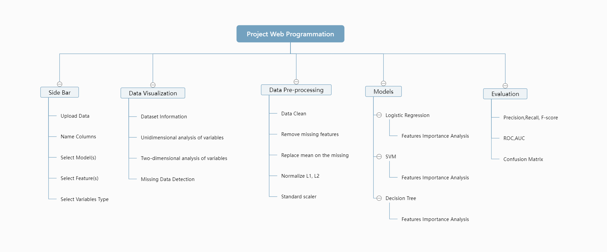

# Implementation

In this section, **the implementation of the application will be explained** in terms of the five different parts mentioned in the previous section.


## Sidebar

The sidebar is a very crucial part because it collects all kinds of information from the user and it is connected to every other part of the website. In general, the Streamlit library was used for this project, as it contains almost all the necessary functions for this part.

The collected information from the user are:

- The Data file uploader.
- The column's names input.
- Training models (Logistic regression, SVM, and Decision tree).
- The features (with a multiselection option).
- The quantitative variables.
- The qualitative variables.

<!-- - The Data file uploader. -->
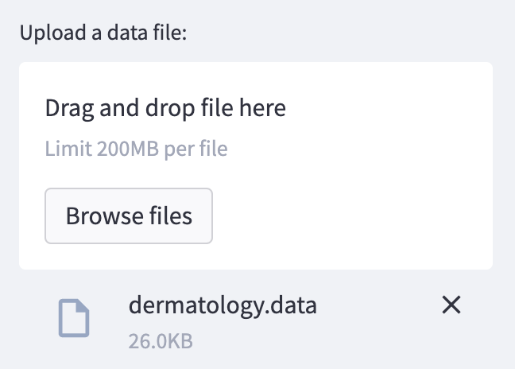

<!-- - The column's names input. -->
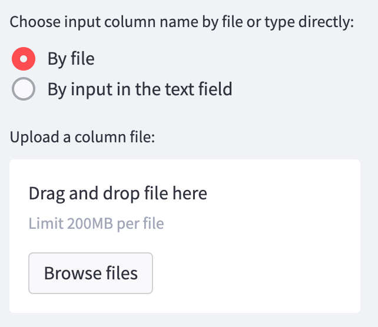


<!-- - Training models (Logistic regression, SVM, and Decision tree). -->
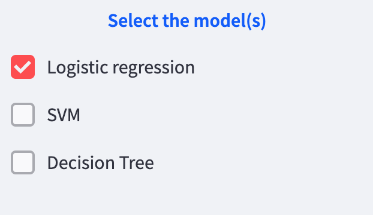

<!-- - The features (with a multiselection option).
- The output -->
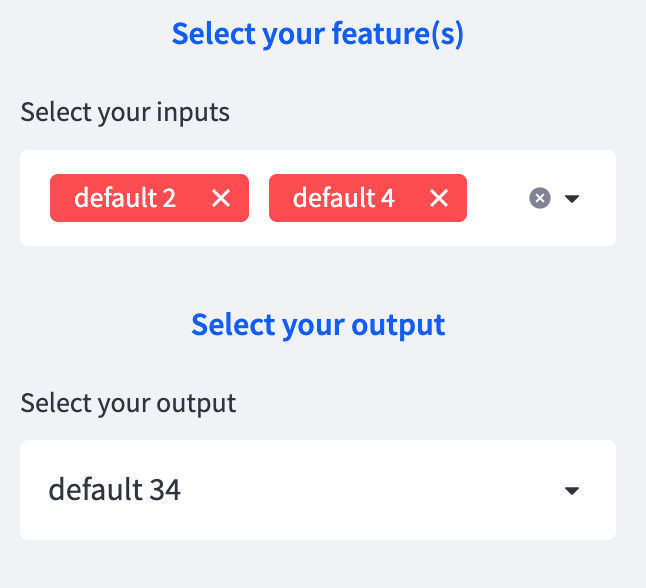

<!-- - the quantitative variables.
- the qualitative variables. -->
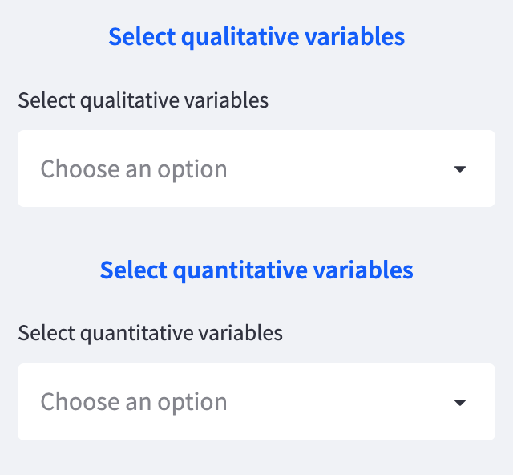


At the end of this function, a dictionary is generated, and it contains all kinds of inputs that were received from the user. Then this dictionary is used by all the other functionalities of the site, as it’s considered a very important tool for the continuity of the execution. 


## Data visualization
After obtaining the dataset from the sidebar, we can start visualizing the data and performing basic EDA analysis. As shown in the architecture, we have four parts, and first, we would like to explain their functions.

- Dataset Information

This part presents the dataset simply and straightforwardly by giving the data frame and the user has three ways to view the dataset: the head of the dataset, the tail of the dataset, and the entire dataset. In addition, the user can view the dimensions of the dataset.

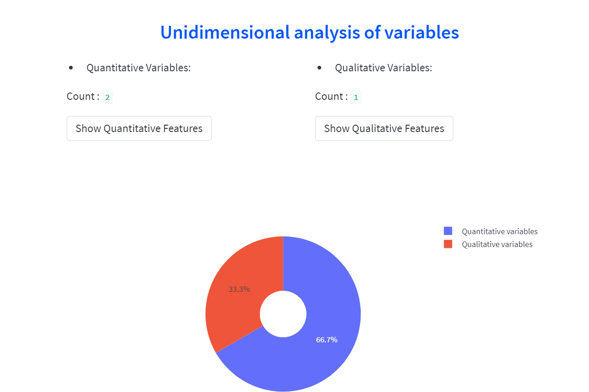


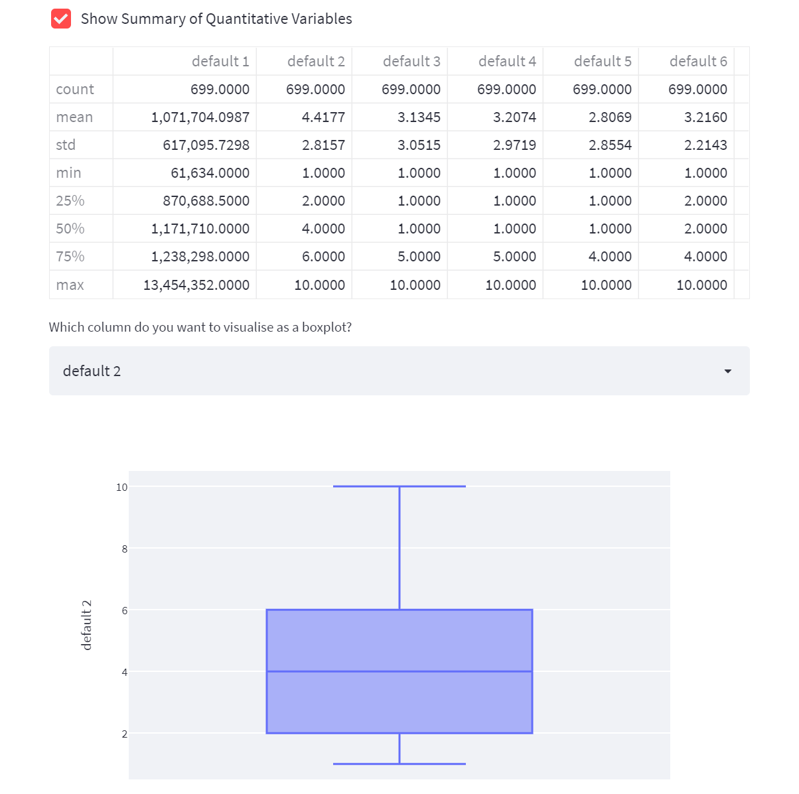

- Unidimensional analysis of variables

In this section, we analyze the dataset in terms of both qualitative and quantitative variables. We first give the percentages of each type of variable so that the user can have a more intuitive view of them, and then we summarize the quantitative variables, in particular, giving basic information such as counts, means, standard deviations with a data frame, and the boxplots, etc. As you can see in the following figure.


- Two-dimensional analysis of variables

A scatter plot showing the relationship between any two selected variables is presented here. In this scatter plot, the user can view multiple X variables in relation to the same Y variable at the same time.

- Missing Data Detection
 
After exploring the nature and relationships of the different variables, we are now interested in the problems that exist in the dataset.  In this application, we detect the missing values and display the columns of missing values by heatmap.

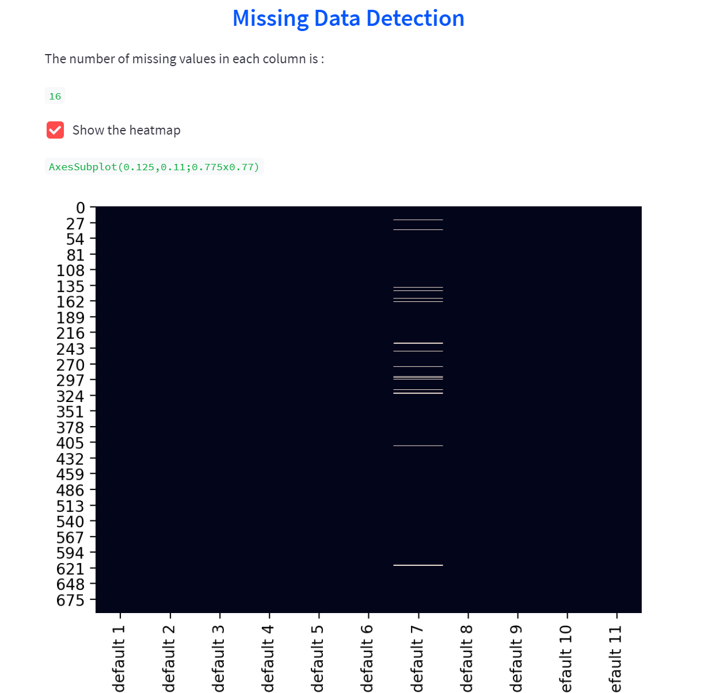

In terms of the tools used, in addition to the basic tools of Streamlit, we also introduced the library Plotly to visualize this data.

## Data preprocessing

After getting the data from the sidebar, the data preprocessing module will process the data before feeding it into the model's module.

The preprocessing module contains:

- NaN handler module.

NaN handler is an important part of preprocessing. We can’t feed the model with a dataframe containing NaN value. In this application, we included 2 methods to eliminate the NaN value before the next step.

Users can choose between removing the NaN rows or replacing NaN values with the mean of the column.

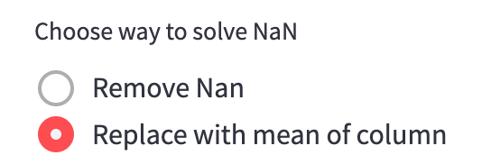

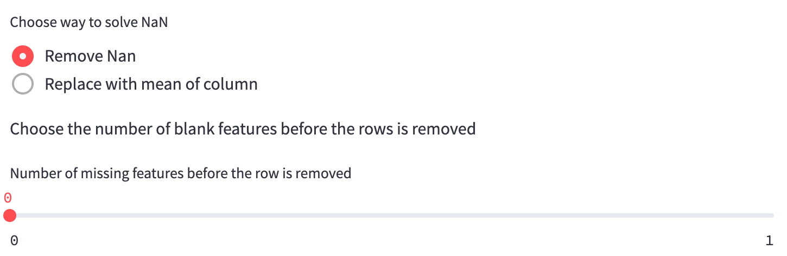


- Normalize:

In general, in most of the datasets, there will be a variety of unbalance between features. In order to solve it, we created a check box for fixing this problem. For example, we have 2 features, 1 have the range of 0 and 10 and one have the range of 10000 and 900000000. It makes the dataset unbalanced and could affect the outcome. We use normalization to eliminate that problem.

Users can choose several types of normalization and balance their data.

- L1 
- L2 
- Max
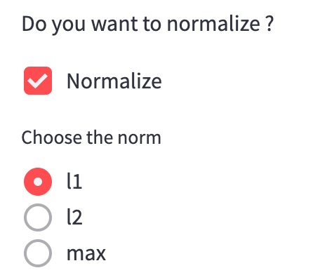

- Feature scaling

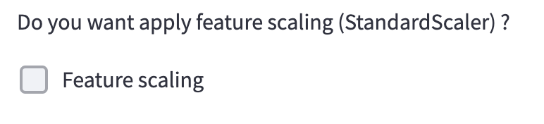

This module uses the StandardScaler function on the sklearn library.

## Models

For the model training part three models were used:

- Logistic Regression 
- Supporting Vector Machine
- Decision Tree

The libraries that were imported:

- sklearn – for training models
- streamlit – for printing the outputs

The model part is divided into 3 parts: creating a function, fitting the models, and calculating predictions. 

First of all, the function model_select was created. At this point, we are using the cleaned data from the file clean.py. Then, we split the data.

1. Test,train,split

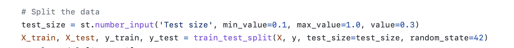

When it comes to splitting the data, the user will have an opportunity to choose the test size sample. The default will be 30%.

From the user’s side it looks like this: 

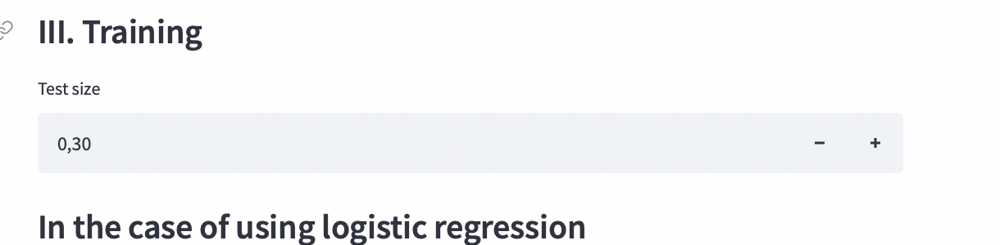

2. At the beginning of the code, we set up the dictionary reslut_models. It will be returned at the end of the function. What is the inside of a dictionary? We added all prediction scores, y sample, y_test sample, X_train,y_train sample, and X_test sample. This dictionary will be used for evaluation purposes. 

3. After the data is defined and split, we have created 3 conditions for each model: Decision Tree, SVM, and Logistic Regression. With each model, the user can precise the type and the criteria. It was done with st.radio option from the streamlit library.  

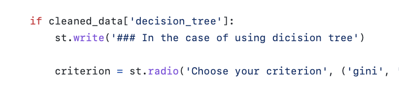

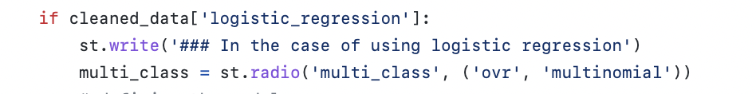

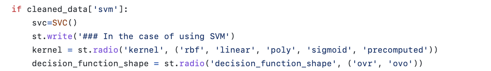

4. When it comes to training models the algorithm is the same for each case.
First, we define the model with the tools from the sklearn library and precise all the criteria and model options that we have already chosen. For example, in the case of Decision Tree we did it like that:

Then we train models, using the **fit** feature from the sklearn library. After models are trained, we call for the prediction score using the **predict** feature and the X_test sample. Overall, the whole training process is displayed in the image. 

When we have the scores, it is crucial to upload them to the dictionary that we created at the beginning **“result_models”**.  As was mentioned earlier, we will pass this dictionary to the evaluation process in order to get the scores such as recall, precision, f1 score, roc_auc_score, etc.

In addition, for each model, we also give the importance of the selected features for training and present them to the user by a bar chart. As shown in the figure below, here is an example of how we measure the important features in the logistic regression model:

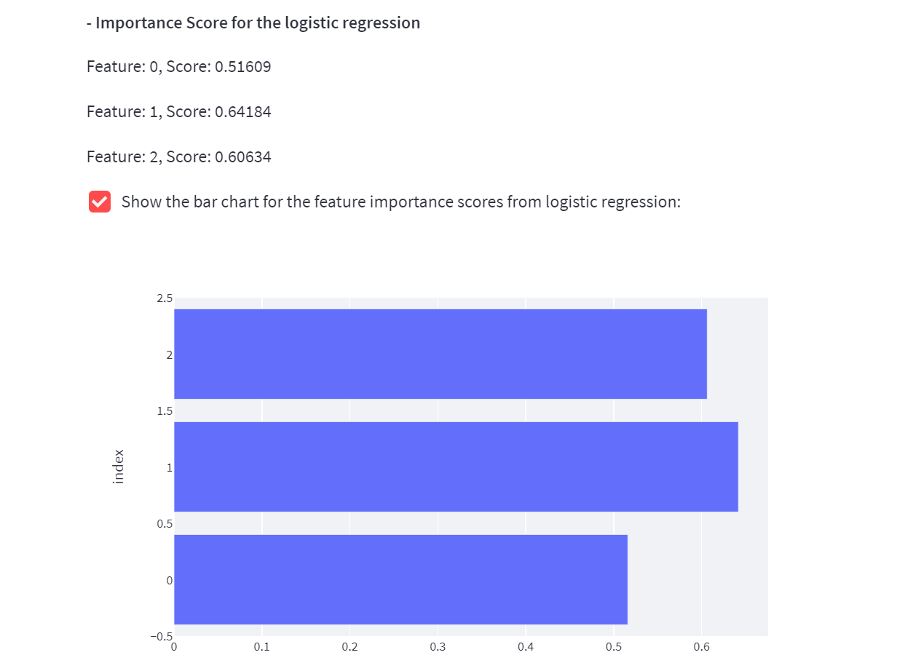

We can see that of the three features measured: feature 0, feature 1, and feature 2, feature 1 has the highest feature importance value of 0.64184, so this variable has a greater impact on model training than the other two. We can also visualize this result on the histogram. 

To conclude, it is worth mentioning that we found that features importance is only discussed in the context of the linear kernel, so we do not perform features importance on SVM.

## Evaluation

This module will handle the outcome of the model's module. It contains:

- Different types of scores:

We have

- Precision
- Recall
- F1 score

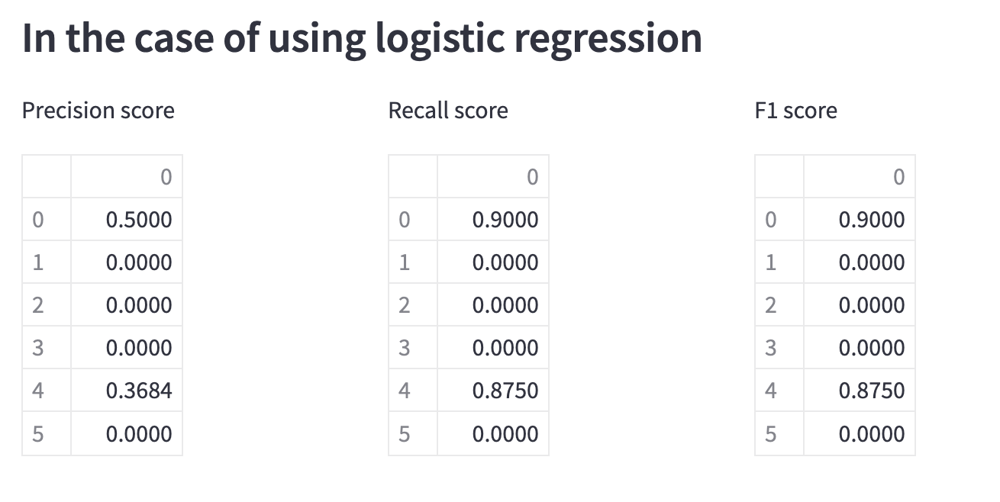

Each model will have a different set of scores. If the user attempts to choose all the models, the function will calculate all the scores of all models.

Users can also choose which type of average method they want to use.

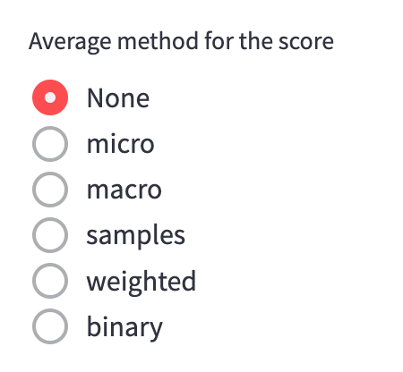

- Confusion matrix

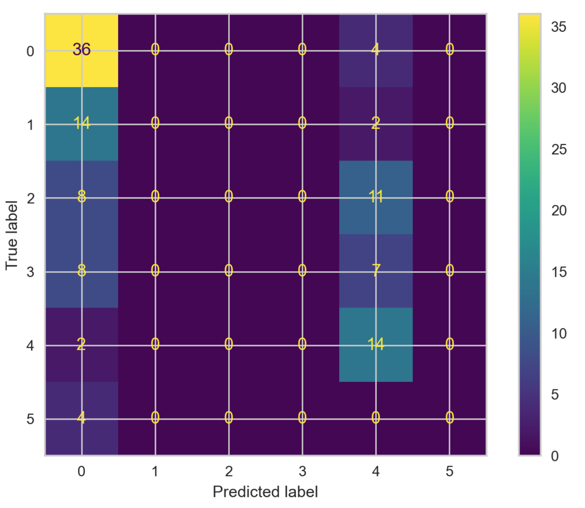

- ROC AUC score

- ROC curve

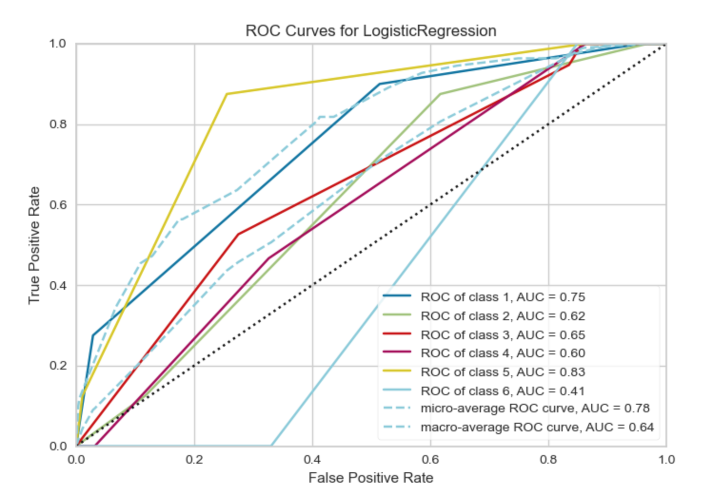

These features for now only work with multi classes.

# Problems encountered

## Determining the nature of variables:

We found that in some datasets the original authors used numbers for qualitative variables, for example, 2 for benign and 4 for malignant in the cancer breast dataset, so it was difficult to determine whether the data was a qualitative or quantitative variable from the type of data itself.

_Solution_: We added an area in the sidebar where the user can select the type of variable so that the determination of the type of variable is more in line with the real use case.

## The collection of sidebar information.

_Solution_: We use a dictionary to store the information selected by the user in the sidebar. Furthermore, we put the contents of the sidebar into a function that can be used in another section such as Data Visualization.

## The Button ‘Done’ in the sidebar:

We faced a problem with the button being reloaded each time we added input and deleted the choices (initialization).

_Solution_: After a long search, it turned out it was a streamlit problem, and a lot of programmers had it, so the solution was to replace it with a ‘checkbox’. 


# Conclusion. What could be done in the future?

This project focuses on constructing a web application using Streamlit in python. The web application made it easier and more intuitive for users to explore the dataset. In addition, by completing this project, we learned more about visualizing datasets, exploratory analysis, and using models for prediction and evaluation. In terms of group collaboration, we had good communication from deciding plans to assigning tasks to weekly meetings to discuss progress. Finally, in terms of improvement, we hope to add more algorithmic models in the future as well as give the user more freedom to personalize his settings.
